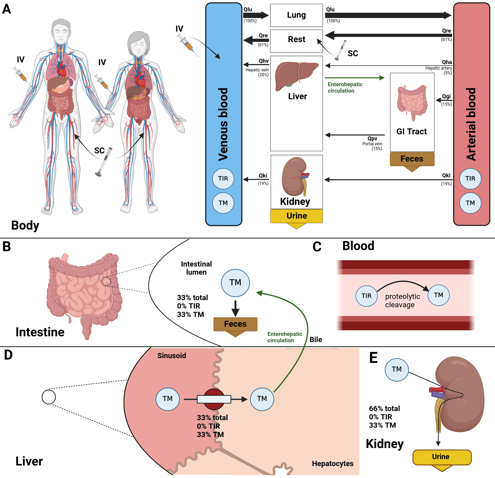

# Tirzepatide model
This repository provides the tirzepatide physiologically based pharmacokinetics (PBPK) model.

The model is distributed as [SBML](http://sbml.org) available from [`tirzepatide_body_flat.xml`](./models/tirzepatide_body_flat.xml) with the COMBINE archive available from [`tirzepatide_model.omex`](./tirzepatide_model.omex).

### Comp submodels
The liver submodel is available from [`tirzepatide_liver.xml`](./models/tirzepatide_liver.xml).

The kidney submodel is available from [`tirzepatide_kidney.xml`](./models/tirzepatide_kidney.xml).

The whole-body submodel is available from [`tirzepatide_body.xml`](./models/tirzepatide_body.xml).

## How to cite

> Mishra, A., & König, M. (2025).
> *Physiologically based pharmacokinetic (PBPK) model of tirzepatide.*   
> Zenodo. [https://doi.org/10.5281/zenodo.14976788](https://doi.org/10.5281/zenodo.14976788)

## License

* Source Code: [MIT](https://opensource.org/license/MIT)
* Documentation: [CC BY-SA 4.0](https://creativecommons.org/licenses/by-sa/4.0/)
* Models: [CC BY-SA 4.0](https://creativecommons.org/licenses/by-sa/4.0/)

## Funding
Matthias König was supported by the Federal Ministry of Education and Research (BMBF, Germany) within LiSyM by grant number 031L0054 and ATLAS by grant number 031L0304B and by the German Research Foundation (DFG) within the Research Unit Program FOR 5151 QuaLiPerF (Quantifying Liver Perfusion-Function Relationship in Complex Resection - A Systems Medicine Approach) by grant number 436883643 and by grant number 465194077 (Priority Programme SPP 2311, Subproject SimLivA). This work was supported by the BMBF-funded de.NBI Cloud within the German Network for Bioinformatics Infrastructure (de.NBI) (031A537B, 031A533A, 031A538A, 031A533B, 031A535A, 031A537C, 031A534A, 031A532B). 

© 2025 Abhinav Mishra and Matthias König, [Systems Medicine of the Liver](https://livermetabolism.com)